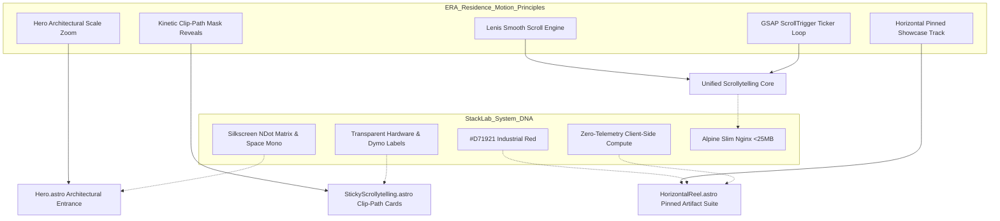
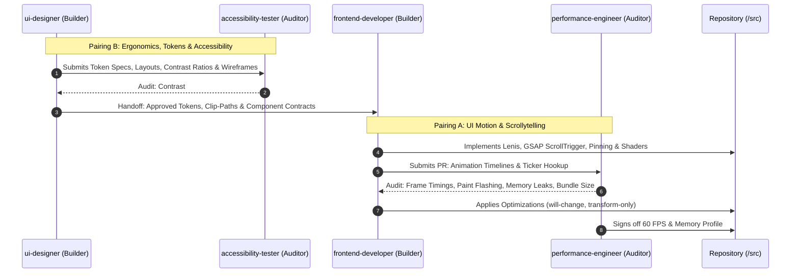

# Orchestrator Plan: Transforming StackLab.work into ERA Residence Choreography

**Target Reference**: ERA Residence ([era-residence.com](https://www.era-residence.com/))  
**Project Path**: `/home/luistler/Proyectos/stacklab-web`  
**System DNA Source**: `/home/luistler/homelab/obsidian-vault/Perfil_Luis/preferencias.md`  
**Architecture**: Astro 5 + Tailwind CSS + GSAP ScrollTrigger + Lenis Smooth Scroll + Client-Side Micro-Tools + Docker Alpine (<25MB)  
**Date**: September 2026  
**Document Status**: READY FOR IMMEDIATE EXECUTION  

---

## 1. Executive Summary & Architectural Scope

This plan orchestrates the complete visual and motion evolution of **StackLab.work** (`/home/luistler/Proyectos/stacklab-web`). The objective is to infuse the high-end architectural grandeur, silky momentum, and kinetic reveals of **ERA Residence** into StackLab's core identity: **Nothing Phone / Nothing OS cyber-industrial brutalism**, `#D71921` crimson accenting, zero-telemetry client-side compute, and 60 FPS mobile/desktop scrollytelling.



### Core Deliverables:
1. **Kinetic Core Foundation**: Lenis 1.1+ integrated with GSAP 3.12+ via decoupled `requestAnimationFrame` ticker loop inside Astro 5 layouts.
2. **Architectural Hero Scale Entrance**: Viewport depth scaling with layered kinetic typography reveals and ambient Nothing glow.
3. **Clip-Path Narrative Deconstruction**: Replacement of basic opacity fades with high-impact geometric polygon/inset clip-path reveals.
4. **Horizontal Pinned Artifact Reel**: A pinned horizontal track showcasing StackLab's functional tools (CIDR Subnet Matrix, Docker to Compose, Shannon Vault) with smooth scrub, progress telemetry, and accessible modal integration.
5. **Ergonomic Tactile Polish & 60 FPS Guarantee**: Web Audio API mechanical feedback, strict `prefers-reduced-motion` compliance, composite-only GPU transitions, and Docker Alpine packaging < 25MB.

---

## 2. Dynamic Dual-Agent Pairings (Builder + Auditor Matrix)

Following the multi-agent orchestration architecture from `preferencias.md` and the scanned agent definitions in `/home/luistler/.gemini/agent-catalog/categories/`, tasks are executed through dynamic dual-agent pairings. Each pair operates in a **Builder ↔ Challenger/Auditor** feedback loop to prevent regressions before code hits the main branch.



### Pairing A: UI Motion & Scrollytelling
* **Builder**: `frontend-developer` (`01-core-development/frontend-developer.md`)
  * **Role**: Lead Motion Engineer.
  * **Concrete Stated Capabilities**: TypeScript interfaces, responsive layouts, component scaffolding, integration of modern client-side libraries with Astro 5, lifecycle hooks.
  * **Responsibilities**: Adding dependencies, writing the Lenis ticker loop, constructing GSAP ScrollTrigger timelines, implementing clip-path CSS/JS triggers, building the horizontal scroll track.
* **Challenger / Auditor**: `performance-engineer` (`04-quality-security/performance-engineer.md`)
  * **Role**: Runtime Performance & Frame Budget Gatekeeper.
  * **Concrete Stated Capabilities**: Bottleneck analysis, CPU/memory profiling, frame timing, identifying layout reflows/paints, garbage collection monitoring, bundle optimization.
  * **Responsibilities**: Enforcing a strict 16.6ms (60 FPS) frame budget, certifying zero layout thrashing (restricting animations to `transform` and `opacity`), auditing Lenis scroll overhead on low-power mobile devices, ensuring ScrollTrigger instances are properly killed on unmount.

### Pairing B: Ergonomics & Accessibility
* **Builder**: `ui-designer` (`01-core-development/ui-designer.md`)
  * **Role**: Visual System & Experience Architect.
  * **Concrete Stated Capabilities**: Visual design systems, interaction patterns, typography scales, dark mode adaptations, Nothing OS design tokens, micro-interaction specifications.
  * **Responsibilities**: Translating ERA Residence's luxury architectural aesthetic into Nothing OS technical brutalism, designing Dymo tape badges, corner crosshair placement, horizontal card layouts, and audio feedback curves.
* **Challenger / Auditor**: `accessibility-tester` (`04-quality-security/accessibility-tester.md`)
  * **Role**: Inclusive Design & WCAG 2.1 AA Compliance Verifier.
  * **Concrete Stated Capabilities**: WCAG 2.1/3.0 AA audits, keyboard navigation flows, screen reader semantics (ARIA), focus management, `prefers-reduced-motion` compliance testing.
  * **Responsibilities**: Ensuring the horizontal pinned reel is 100% operable via keyboard (Tab / Arrow keys) and screen readers, verifying contrast of `#D71921` against dark surfaces, certifying full degradation to clean static layouts when reduced motion is requested.

---

## 3. Work Breakdown Structure (5 Workstreams, 14 Subtasks)

```mermaid
gantt
    title StackLab to ERA Residence Transformation Timeline
    dateFormat  X
    axisFormat Step %d
    
    section WS1: Core & Motion Engine
    ST-1.1 Deps & Bundle Setup       :active, ws1_1, 0, 2
    ST-1.2 Lenis-GSAP Ticker Engine   :ws1_2, 2, 4
    ST-1.3 Design Tokens & Typography :ws1_3, 1, 3
    
    section WS2: Hero Zoom Entrance
    ST-2.1 Hero Viewport Layout       :ws2_1, 3, 5
    ST-2.2 GSAP Depth Scrub           :ws2_2, 4, 6
    ST-2.3 Motion & A11y Audit        :ws2_3, 6, 7
    
    section WS3: Clip-Path Scrollytelling
    ST-3.1 Sticky Narrative Layout    :ws3_1, 5, 7
    ST-3.2 Inset/Polygon Mask Scrub   :ws3_2, 6, 8
    ST-3.3 Audio Micro-Sync           :ws3_3, 7, 9
    
    section WS4: Horizontal Showcase Reel
    ST-4.1 Pinned Track Scaffolding   :ws4_1, 7, 9
    ST-4.2 Horizontal GSAP Scrub      :ws4_2, 8, 10
    ST-4.3 Client-Side Tool Modals    :ws4_3, 9, 11
    
    section WS5: Production Verification
    ST-5.1 60 FPS & A11y Signoff      :ws5_1, 10, 12
    ST-5.2 Docker <25MB & Build Check :ws5_2, 11, 13
```



---

### Workstream 1: Foundation, Dependencies & Global Motion Core

#### Subtask 1.1: Dependency Additions & Bundle Baseline
- **Objective**: Install modern Lenis (`lenis`) and GSAP core with ScrollTrigger (`gsap`), along with TypeScript type definitions (`@types/gsap`), without bloating client bundles.
- **Assigned Agents**:
  - *Builder*: `frontend-developer`
  - *Auditor*: `performance-engineer`
- **Commands & Configuration**:
  ```bash
  npm install lenis gsap
  npm install -D @types/gsap
  ```
- **Handoff Artifacts**: Updated `package.json`, `package-lock.json`.
- **Completion Criteria**: Clean install with zero peer dependency conflicts, verified tree-shaking support in Vite/Astro.

#### Subtask 1.2: Global Smooth Scroll & Lenis-GSAP Ticker Loop
- **Objective**: Establish the unified smooth scroll runtime in `src/layouts/Layout.astro`. Synchronize Lenis with GSAP ScrollTrigger via the canonical ticker hook so that all pinned triggers evaluate in lockstep with the virtual scroll.
- **Assigned Agents**:
  - *Builder*: `frontend-developer`
  - *Auditor*: `performance-engineer`
- **Technical Specification**:
  ```typescript
  // src/scripts/motion-engine.ts
  import Lenis from 'lenis';
  import { gsap } from 'gsap';
  import { ScrollTrigger } from 'gsap/ScrollTrigger';

  export function initMotionEngine() {
    gsap.registerPlugin(ScrollTrigger);

    const lenis = new Lenis({
      duration: 1.15,
      easing: (t: number) => Math.min(1, 1.001 - Math.pow(2, -10 * t)),
      smoothWheel: true,
      touchMultiplier: 1.5,
      infinite: false,
    });

    // Synchronize Lenis scroll updates with GSAP ScrollTrigger
    lenis.on('scroll', ScrollTrigger.update);

    // Bind Lenis raf to GSAP's internal high-precision ticker
    gsap.ticker.add((time) => {
      lenis.raf(time * 1000);
    });

    // Disable GSAP lag smoothing to maintain lockstep with Lenis inertia
    gsap.ticker.lagSmoothing(0);

    // Handle Anchor links smoothly
    document.querySelectorAll('a[href^="#"]').forEach((anchor) => {
      anchor.addEventListener('click', (e) => {
        e.preventDefault();
        const targetId = anchor.getAttribute('href');
        if (targetId && targetId !== '#') {
          lenis.scrollTo(targetId, { offset: -30 });
        }
      });
    });

    return { lenis, ScrollTrigger };
  }
  ```
- **Handoff Artifacts**: `src/scripts/motion-engine.ts`, `src/layouts/Layout.astro`.
- **Completion Criteria**: Seamless inertial scrolling across all browsers; no scroll jumps on hash navigation; GSAP ticker active without unconstrained CPU loops.

#### Subtask 1.3: Design Tokens & Editorial Kinetic Typography System
- **Objective**: Extend Tailwind configuration and CSS layers with ERA-style editorial typography tokens, mask utilities, and Nothing Phone styling accents.
- **Assigned Agents**:
  - *Builder*: `ui-designer`
  - *Auditor*: `accessibility-tester`
- **Technical Specification**:
  - Update `tailwind.config.mjs`:
    - Editorial display font sizes: `text-hero: clamp(3.5rem, 8vw, 8.5rem)`
    - Aspect ratios: `aspect-[16/10]`, `aspect-[4/3]`
    - Red accent palette: `nothing-red: '#D71921'`, `nothing-red-glow: 'rgba(215, 25, 33, 0.35)'`
  - Update `src/styles/global.css`:
    - Text reveal masks: `.editorial-mask { overflow: hidden; display: block; }`
    - Clip-path presets: `.clip-diagonal`, `.clip-inset-reveal`, `.clip-squircle`
    - Full `@media (prefers-reduced-motion: reduce)` rules resetting all transforms.
- **Handoff Artifacts**: `tailwind.config.mjs`, `src/styles/global.css`.
- **Completion Criteria**: Accessible font contrast (>4.5:1 for body, >3:1 for large display); verified CSS classes ready for motion layers.

---

### Workstream 2: Hero Scale Zoom & Architectural Entrance

#### Subtask 2.1: Hero Viewport Layout & Depth Stacking Structure
- **Objective**: Redesign `src/components/Hero.astro` with an architectural 3D depth-layering stack inspired by ERA Residence's grand entrance.
- **Assigned Agents**:
  - *Builder*: `ui-designer`
  - *Auditor*: `accessibility-tester`
- **Layout Architecture**:
  1. *Layer 0 (Background)*: Deep dark grid `#0B0B0B` + ambient Nothing Red radial glow.
  2. *Layer 1 (Architectural Blueprint/Grid Canvas)*: Interactive dot-matrix topology canvas that scales outward.
  3. *Layer 2 (Kinetic Typography)*: Split editorial text (`PURE LOGIC // ZERO NOISE`) with Dymo embossed badges.
  4. *Layer 3 (Foreground Telemetry & Dock)*: Live local status pill, mechanical click sound toggle, and scroll indicator.
- **Handoff Artifacts**: `src/components/Hero.astro` template markup and scoped CSS.
- **Completion Criteria**: Semantic HTML tags (`<header>`, `<nav>`, `<h1>`), clean hierarchy, readable at 320px up to 4K displays.

#### Subtask 2.2: GSAP ScrollTrigger Depth Zoom & Kinetic Reveal Timeline
- **Objective**: Implement a scrubbed ScrollTrigger timeline that zooms into the background canvas while subtly scaling down and dissolving foreground typography as the user scrolls into the narrative section.
- **Assigned Agents**:
  - *Builder*: `frontend-developer`
  - *Auditor*: `performance-engineer`
- **Technical Specification**:
  ```typescript
  // Hero ScrollTrigger Choreography
  const heroTimeline = gsap.timeline({
    scrollTrigger: {
      trigger: '#hero-container',
      start: 'top top',
      end: '+=100%',
      pin: true,
      scrub: 0.8,
      anticipatePin: 1,
    }
  });

  heroTimeline
    .to('.hero-bg-canvas', { scale: 1.18, filter: 'blur(4px)', ease: 'power2.out' }, 0)
    .to('.hero-title-line-1', { yPercent: -40, opacity: 0.2, ease: 'power1.inOut' }, 0)
    .to('.hero-title-line-2', { yPercent: -60, opacity: 0, ease: 'power1.inOut' }, 0.1)
    .to('.hero-telemetry-badge', { scale: 0.9, opacity: 0, ease: 'power1.in' }, 0)
    .to('.hero-scroll-cue', { opacity: 0, duration: 0.2 }, 0);
  ```
- **Handoff Artifacts**: `src/components/Hero.astro` `<script>` section.
- **Completion Criteria**: Silky scrub response directly coupled to wheel/touch; zero judder or paint flash; pinned container unpins cleanly.

#### Subtask 2.3: Hero Motion Performance Audit & Reduced-Motion Degradation
- **Objective**: Validate compositor execution and ensure users with vestibular sensitivities receive an immediate static presentation.
- **Assigned Agents**:
  - *Builder*: `performance-engineer`
  - *Auditor*: `accessibility-tester`
- **Audit Steps**:
  - Confirm GPU promotion via `will-change: transform`.
  - Enforce `ScrollTrigger.matchMedia({ "(prefers-reduced-motion: reduce)": ... })` returning unpinned static layout.
- **Completion Criteria**: Verified 0 layout reflows during scrub; immediate pass of automated a11y checks.

---

### Workstream 3: Architectural Clip-Path Scrollytelling (Narrative Steps)

#### Subtask 3.1: Narrative Stream Architecture & Sticky Viewport Framework
- **Objective**: Overhaul `src/components/StickyScrollytelling.astro` to adopt ERA Residence's architectural card-mask transitions, replacing generic opacity fades.
- **Assigned Agents**:
  - *Builder*: `ui-designer`
  - *Auditor*: `accessibility-tester`
- **Visual Concepts**:
  - Step 1: *DISSECT / SCHEMATIC 01* — Circuit topology schematic with dynamic line-drawing clip-path.
  - Step 2: *ASSEMBLE / RUNTIME 02* — Docker Compose compiled code block with industrial terminal aesthetics.
  - Step 3: *IGNITION / RUNTIME 03* — Deployed edge node badge with radiant Nothing red halo.
- **Handoff Artifacts**: `src/components/StickyScrollytelling.astro`.
- **Completion Criteria**: Responsive single-column on mobile, split-stage pinned layout on desktop.

#### Subtask 3.2: Polygon & Inset Clip-Path Choreography
- **Objective**: Build GSAP ScrollTrigger timeline scrubbing CSS `clip-path: inset()` and `polygon()` masks to reveal subsequent narrative cards like structural architectural panels.
- **Assigned Agents**:
  - *Builder*: `frontend-developer`
  - *Auditor*: `performance-engineer`
- **Technical Specification**:
  ```typescript
  // Architectural Clip-Path Mask Reveal
  gsap.utils.toArray<HTMLElement>('.clip-reveal-card').forEach((card, index) => {
    gsap.fromTo(card, 
      { 
        clipPath: 'polygon(0% 100%, 100% 100%, 100% 100%, 0% 100%)',
        scale: 0.96,
        y: 60
      },
      {
        clipPath: 'polygon(0% 0%, 100% 0%, 100% 100%, 0% 100%)',
        scale: 1,
        y: 0,
        ease: 'power3.out',
        scrollTrigger: {
          trigger: card,
          start: 'top 75%',
          end: 'top 35%',
          scrub: true,
        }
      }
    );
  });
  ```
- **Handoff Artifacts**: `src/components/StickyScrollytelling.astro`, `src/styles/global.css`.
- **Completion Criteria**: Hardware-accelerated clip-path interpolation; no CPU clipping bottlenecks on Safari or Chromium.

#### Subtask 3.3: Interactive Schematic Cards & Tactile Audio Synchronization
- **Objective**: Connect narrative step transitions to StackLab's Web Audio API mechanical click engine, playing subtle frequency shifts (1200Hz → 1400Hz → 1600Hz) upon crossing step boundaries.
- **Assigned Agents**:
  - *Builder*: `frontend-developer`
  - *Auditor*: `accessibility-tester`
- **Handoff Artifacts**: `src/components/StickyScrollytelling.astro`.
- **Completion Criteria**: Sound plays exclusively on intentional user-driven scroll; audio toggle state honored; volume clamped to subtle ambient levels (<0.15 gain).

---

### Workstream 4: Horizontal Showcase Reel (Functional Artifacts)

#### Subtask 4.1: Horizontal Pinned Track Architecture
- **Objective**: Recreate ERA Residence's signature horizontal pinned location/amenities reel as StackLab's **Functional Artifacts Reel**, replacing the traditional vertical `BentoGrid.astro` layout with a sleek horizontal gallery.
- **Assigned Agents**:
  - *Builder*: `ui-designer`
  - *Auditor*: `accessibility-tester`
- **Showcase Items**:
  1. **Artifact 01**: `CIDR Subnet Matrix` (Interactive 32-bit IPv4 CCNA calculator).
  2. **Artifact 02**: `Docker to Compose` (One-liner CLI converter & env generator).
  3. **Artifact 03**: `Shannon Vault` (CSPRNG Entropy & SHA-256 WebCrypto laboratory).
- **Handoff Artifacts**: `src/components/HorizontalReel.astro` (or updated `BentoGrid.astro`).
- **Completion Criteria**: Desktop full-height viewport track with slide index telemetry (`[01 / 03]`), progress scrubber bar, and launch action buttons.

#### Subtask 4.2: ScrollTrigger Pinned Scrub & Track Translation
- **Objective**: Pin the reel section and translate the inner container horizontally across `(totalWidth - viewportWidth)` with GSAP ScrollTrigger.
- **Assigned Agents**:
  - *Builder*: `frontend-developer`
  - *Auditor*: `performance-engineer`
- **Technical Specification**:
  ```typescript
  // Horizontal Reel Pinned Track
  const reelSection = document.querySelector('#artifacts-reel') as HTMLElement;
  const reelTrack = document.querySelector('.horizontal-track') as HTMLElement;
  const progressBar = document.querySelector('.reel-progress-fill') as HTMLElement;
  const counterCurrent = document.querySelector('.reel-counter-current') as HTMLElement;

  if (reelSection && reelTrack) {
    const totalScroll = reelTrack.scrollWidth - window.innerWidth + 120; // with padding

    gsap.to(reelTrack, {
      x: -totalScroll,
      ease: 'none',
      scrollTrigger: {
        trigger: reelSection,
        pin: true,
        scrub: 0.9,
        start: 'top top',
        end: () => `+=${totalScroll}`,
        invalidateOnRefresh: true,
        onUpdate: (self) => {
          if (progressBar) {
            progressBar.style.transform = `scaleX(${self.progress})`;
          }
          if (counterCurrent) {
            const slideIndex = Math.min(3, Math.floor(self.progress * 3) + 1);
            counterCurrent.textContent = `0${slideIndex}`;
          }
        }
      }
    });
  }
  ```
- **Handoff Artifacts**: `src/components/HorizontalReel.astro`.
- **Completion Criteria**: Total scroll distance matches content perfectly; dynamic recalculation on window resize (`invalidateOnRefresh: true`).

#### Subtask 4.3: Artifact Card Modal Bindings & Accessible Controls
- **Objective**: Wire up the three interactive modal dialogues (`CidrModal.astro`, `DockerModal.astro`, `CryptoModal.astro`) from within the horizontal cards without breaking GSAP pin layout or scroll lock.
- **Assigned Agents**:
  - *Builder*: `frontend-developer`
  - *Auditor*: `accessibility-tester`
- **Requirements**:
  - When modal opens: Pause Lenis (`lenis.stop()`), preserve horizontal scroll position.
  - When modal closes: Resume Lenis (`lenis.start()`), return focus to the originating launch card.
  - Full keyboard accessibility: Arrow Left/Right navigates between reel slides; Tab key loops within active card.
- **Handoff Artifacts**: `src/components/HorizontalReel.astro`, `src/components/tools/*.astro`.
- **Completion Criteria**: Zero telemetry maintained; zero modal clipping during horizontal translation; 100% keyboard navigable.

---

### Workstream 5: Performance, Accessibility & Production Verification

#### Subtask 5.1: 60 FPS Profiling, Paint Invalidation & WCAG 2.1 AA Motion Audit
- **Objective**: Conduct rigorous runtime profiling under simulated throttling (4x CPU slowdown) to ensure silky 60 FPS scrolling and full WCAG 2.1 AA compliance.
- **Assigned Agents**:
  - *Builder*: `performance-engineer`
  - *Auditor*: `accessibility-tester`
- **Verification Steps**:
  1. **Frame Rate Audit**: Record Chrome Performance trace while scrolling from Hero to Footer. Verify frame duration ≤ 16.6ms with zero long tasks (>50ms).
  2. **Memory Leak Audit**: Verify JS Heap remains stable after 10 full up-and-down scroll cycles (confirming ScrollTrigger events garbage-collect cleanly).
  3. **WCAG Motion Audit**: Test with OS `prefers-reduced-motion: reduce`. The page must present all cards in a clean vertical stack without forced horizontal pinning or zooming.
- **Handoff Artifacts**: `PERFORMANCE_ACCESSIBILITY_AUDIT.md`.
- **Completion Criteria**: 60 FPS steady; zero critical a11y violations; Lighthouse Performance ≥ 95.

#### Subtask 5.2: Astro 5 Production Build & Docker Alpine Packaging (<25MB)
- **Objective**: Execute static compilation via Astro 5, verify assets, and confirm the resulting Docker container adheres to StackLab's strict homelab budget (<25MB).
- **Assigned Agents**:
  - *Builder*: `frontend-developer`
  - *Auditor*: `performance-engineer`
  - *Supplementary Reviewer Flag*: `docker-expert` (`03-infrastructure/docker-expert.md`) for container size optimization if bundle exceeds limits.
- **Commands**:
  ```bash
  npm run check
  npm run build
  docker build -t stacklab-web:era-test .
  docker images stacklab-web:era-test
  ```
- **Handoff Artifacts**: Built `/dist` directory, Docker image inspection report.
- **Completion Criteria**: Zero TypeScript / Astro check errors; compiled image size ≤ 25MB on Alpine slim Nginx; `/health` endpoint 200 OK.

---

## 4. Verification & Quality Checklist

| Checkpoint | Target Metric | Verifying Agent | Pass/Fail Condition |
| :--- | :--- | :--- | :--- |
| **Scroll Performance** | 60 FPS steady (≤16.6ms/frame) | `performance-engineer` | No dropped frames during scrub |
| **Memory Footprint** | JS Heap Delta < 8MB after 10 scrubs | `performance-engineer` | Zero ScrollTrigger event listener leaks |
| **Bundle Impact** | Lenis + GSAP combined < 45KB gzip | `performance-engineer` | Tree-shaken core only, no unused plugins |
| **A11y Standards** | WCAG 2.1 Level AA | `accessibility-tester` | Zero Axe-core / Lighthouse a11y errors |
| **Reduced Motion** | Instant unpinned fallback | `accessibility-tester` | Smooth reading experience with animations off |
| **Keyboard Operability** | 100% accessible without mouse | `accessibility-tester` | Tab order preserved across horizontal track |
| **Build Integrity** | Astro 5 static compilation | `frontend-developer` | Zero TS/Astro compiler warnings or errors |
| **Container Size** | Docker Alpine Image < 25MB | `performance-engineer` / `docker-expert` | `docker images` size strictly under 25MB |

---

## 5. Execution Handoff & Next Actions

This orchestrator plan provides the exact blueprint for execution. To begin immediately, invoke the respective dual pairs:

1. **Phase 1 (Motion & Layout Setup)**: Hand Subtasks 1.1–1.3 to **Pairing A** (`frontend-developer` + `performance-engineer`) and **Pairing B** (`ui-designer` + `accessibility-tester`).
2. **Phase 2 (Hero & Narrative Polish)**: Hand Subtasks 2.1–3.3 to **Pairing A** and **Pairing B**.
3. **Phase 3 (Horizontal Reel & Artifacts)**: Hand Subtasks 4.1–4.3 to **Pairing A** and **Pairing B**.
4. **Phase 4 (Final Sign-off)**: Run Subtasks 5.1–5.2 for production deployment.
