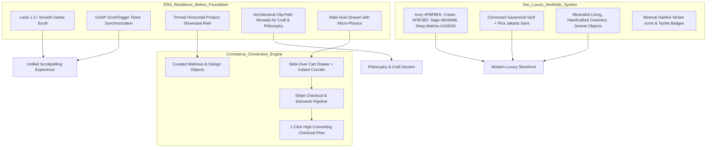
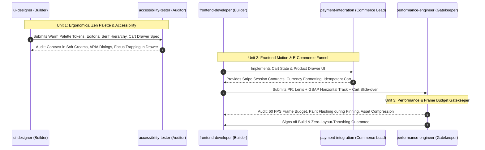

# Orchestrator Plan: Pivot to Zen & Luxury E-Commerce (ERA Motion Standard)

**Target Brand Reference**: ERA Residence Motion Architecture ([era-residence.com](https://www.era-residence.com/))  
**Project Path**: `/home/luistler/Proyectos/stacklab-web`  
**Brand Concept**: *StackLab Atelier // Mindful Objects & Serene Living*  
**Aesthetic**: Zen Luxury, Warm Ivory, Sage Green, Forest Matcha, Editorial Serif (Cormorant Garamond + Plus Jakarta Sans)  
**Commerce Core**: Product Catalog, Slide-over Cart Drawer, Stripe Platform Checkout Architecture  
**Motion Standard**: Lenis Smooth Scroll + GSAP ScrollTrigger + Horizontal Pinned Catalog + Clip-Path Narrative Reveals  
**Document Status**: READY FOR IMMEDIATE MULTI-AGENT EXECUTION  

---

## 1. Executive Summary & Pivot Scope

This plan orchestrates the **total transformation** of `/home/luistler/Proyectos/stacklab-web` from a cyber-industrial developer workbench into a **high-converting, luxury Zen e-commerce web application**. 

All technical jargon (zero-telemetry, CIDR, CCNA, Docker, edge-ping, terminal code) is permanently retired. In its place, the platform embraces **mindful craftsmanship, organic aesthetics, serene living artifacts, and a frictionless sales funnel**, while maintaining the silky 60 FPS scrollytelling choreography popularized by **ERA Residence**.



---

## 2. Dynamic Agent Pairings & Triads

To ensure flawless execution across visual luxury, motion physics, transaction security, and 60 FPS performance, we assemble three coordinated agent units based on their scanned definitions in `/home/luistler/.gemini/agent-catalog/categories/`:



### Unit 1: Ergonomics, Zen Palette & Inclusive Design
* **Lead Builder**: [`ui-designer`](file:///home/luistler/.gemini/agent-catalog/categories/01-core-development/ui-designer.md)
  * *Stated Capabilities*: Visual design systems, interaction patterns, typography scales, luxury editorial aesthetics, micro-interactions, responsive e-commerce layouts.
  * *Deliverables*: Warm palette design tokens (`#FBFBFA`, `#8A9A86`, `#243026`), Cormorant Garamond typography scales, product card grids, slide-over cart drawer layouts, serene badge styles.
* **Challenger / Auditor**: [`accessibility-tester`](file:///home/luistler/.gemini/agent-catalog/categories/04-quality-security/accessibility-tester.md)
  * *Stated Capabilities*: WCAG 2.1/3.0 Level AA audits, screen reader semantics (ARIA 1.2), keyboard focus trapping, `prefers-reduced-motion` compliance.
  * *Deliverables*: Accessible color contrast ratios for light palettes, keyboard focus management inside the slide-over cart, `aria-live` announcements for cart additions, reduced-motion fallback matrix.

### Unit 2: Frontend Motion & High-Converting Commerce
* **Lead Motion Builder**: [`frontend-developer`](file:///home/luistler/.gemini/agent-catalog/categories/01-core-development/frontend-developer.md)
  * *Stated Capabilities*: Modern web applications, TypeScript interfaces, responsive components, integration of client-side motion engines (GSAP, Lenis) into Astro 5.
  * *Deliverables*: Lenis virtual scroll ticker, Hero depth zoom, horizontal pinned product showcase, clip-path mask reveals, reactive cart drawer component.
* **Commerce & Stripe Architect**: [`payment-integration`](file:///home/luistler/.gemini/agent-catalog/categories/07-specialized-domains/payment-integration.md)
  * *Stated Capabilities*: Gateway integration, transaction processing, PCI compliance, checkout flows, Webhook reliability, token management, error handling.
  * *Deliverables*: Client-side cart state store, Stripe publishable key configuration, checkout session dispatch handler, price calculation, tax and shipping display formatters.

### Unit 3: Runtime Performance & Frame Gatekeeper
* **Auditor & Gatekeeper**: [`performance-engineer`](file:///home/luistler/.gemini/agent-catalog/categories/04-quality-security/performance-engineer.md)
  * *Stated Capabilities*: Bottleneck analysis, frame timing profiling, CPU/GPU compositor audits, memory leak detection, asset size optimization.
  * *Deliverables*: Enforcing a strict 16.6ms (60 FPS) frame budget during horizontal pinned scroll, auditing high-res image decoding overhead (WebP/AVIF), ensuring zero layout thrashing when the cart drawer mounts.

---

## 3. Work Breakdown Structure (6 Workstreams, 16 Subtasks)

```mermaid
gantt
    title Zen Luxury E-Commerce Pivot Roadmap
    dateFormat  X
    axisFormat Step %d

    section WS1: Zen Palette & Core
    ST-1.1 Zen Design Tokens & Typography   :active, ws1_1, 0, 2
    ST-1.2 Motion Engine Retention (Lenis)   :ws1_2, 1, 3
    ST-1.3 Luxury Nav & Cart Badge          :ws1_3, 2, 4

    section WS2: Serene Hero Entrance
    ST-2.1 Hero Editorial Layout            :ws2_1, 3, 5
    ST-2.2 GSAP Serene Zoom Timeline        :ws2_2, 4, 6

    section WS3: Craft & Philosophy
    ST-3.1 Philosophy Scrollytelling Setup  :ws3_1, 5, 7
    ST-3.2 Clip-Path Architectural Masks    :ws3_2, 6, 8

    section WS4: Horizontal Catalog Reel
    ST-4.1 Product Data Catalog Schema      :ws4_1, 5, 7
    ST-4.2 Pinned Horizontal Product Reel   :ws4_2, 7, 9
    ST-4.3 Quick-View Modal & Add to Cart   :ws4_3, 8, 10

    section WS5: Commerce & Stripe Engine
    ST-5.1 Cart Drawer Slide-Over & State   :ws5_1, 8, 11
    ST-5.2 Stripe Checkout Pipeline         :ws5_2, 10, 12
    ST-5.3 Floating Quick-Action Bar        :ws5_3, 11, 13

    section WS6: Verification & Polish
    ST-6.1 60 FPS & Paint Audit             :ws6_1, 12, 14
    ST-6.2 WCAG 2.1 AA A11y Audit           :ws6_2, 13, 15
    ST-6.3 Production Build & Packaging     :ws6_3, 14, 16
```



---

### Workstream 1: Zen & Luxury Design System & Foundation Overhaul

#### Subtask 1.1: Visual System, Color Palette & Editorial Typography
- **Objective**: Overhaul `tailwind.config.mjs` and `src/styles/global.css`. Replace dark cyber-industrial styles with warm, calm, organic Zen luxury tones and editorial typography.
- **Assigned Agents**: `ui-designer` (Builder) + `accessibility-tester` (Auditor)
- **Design Tokens Specification**:
  ```javascript
  // tailwind.config.mjs - Zen Luxury Palette
  colors: {
    zen: {
      ivory: '#FBFBFA',      // Primary background
      cream: '#F5F3EF',      // Secondary surface / cards
      sand: '#EBE7DF',       // Borders & subtle dividers
      stone: '#C7C2B6',      // Inactive badges / outlines
      sage: '#8A9A86',       // Primary accent / botanical highlight
      'sage-light': '#DCE3DA',
      matcha: '#4A5B48',     // Secondary deep green
      forest: '#243026',     // Hero headers & primary buttons
      charcoal: '#1C1F1D',   // Deep body text
      clay: '#B87D65',       // Warm terracotta secondary accent
    }
  },
  fontFamily: {
    serif: ['"Cormorant Garamond"', 'Georgia', 'serif'],
    sans: ['"Plus Jakarta Sans"', 'Inter', 'sans-serif'],
  }
  ```
- **Handoff Artifacts**: `tailwind.config.mjs`, `src/styles/global.css`.
- **Completion Criteria**: Complete removal of `#D71921`, tech-dots, and NDot Silkscreen; WCAG AA contrast ratio (>4.5:1 for body `#1C1F1D` on `#FBFBFA` and `#F5F3EF`).

#### Subtask 1.2: Motion Engine Retention & Smooth Scroll Tuning
- **Objective**: Reconfigure the Lenis 1.1+ and GSAP ScrollTrigger ticker integration in `src/layouts/Layout.astro` for silky, weighted inertia appropriate for high-end luxury browsing.
- **Assigned Agents**: `frontend-developer` (Builder) + `performance-engineer` (Auditor)
- **Technical Specification**:
  - Lenis duration tuned to `1.25s` with smooth quadratic ease-out.
  - Integration with GSAP `ticker.add((time) => lenis.raf(time * 1000))` and `gsap.ticker.lagSmoothing(0)`.
- **Handoff Artifacts**: `src/layouts/Layout.astro`, `src/scripts/motion-engine.ts`.
- **Completion Criteria**: Smooth, drift-free scrolling with zero frame drops during wheel or swipe events.

#### Subtask 1.3: Luxury Navigation Header with Dynamic Cart Trigger
- **Objective**: Rebuild `src/components/Navigation.astro` into an ethereal, floating glassmorphic header with minimal typography, brand wordmark (*STACKLAB ATELIER*), navigation links (*Objects, Philosophy, Craft*), and an interactive Cart trigger button with an animated item count badge.
- **Assigned Agents**: `ui-designer` (Builder) + `accessibility-tester` (Auditor)
- **Handoff Artifacts**: `src/components/Navigation.astro`.
- **Completion Criteria**: Header blurs gently over light surfaces (`backdrop-blur-md bg-zen-ivory/80`); cart badge pulses subtly upon adding items; fully accessible keyboard trigger.

---

### Workstream 2: Zen Architectural Hero & Sensory Entrance

#### Subtask 2.1: Serene Hero Layout & Editorial Typography
- **Objective**: Replace `src/components/Hero.astro` with an architectural entrance featuring Cormorant Garamond typography, serene natural light imagery, and calm editorial copy.
- **Assigned Agents**: `ui-designer` (Builder) + `accessibility-tester` (Auditor)
- **Editorial Copy Concept**:
  - Main Headline: *"LIVING WITH INTENTION."* / *"OBJECTS CRAFTED FOR SERENITY."*
  - Subtitle: *"A curated collection of minimalist home objects, timeless ceramics, and botanical essentials designed to bring quiet beauty to modern spaces."*
  - Action Triggers: `[ Explore Collection ↓ ]` & `[ View Essentials ]`
- **Handoff Artifacts**: `src/components/Hero.astro`.
- **Completion Criteria**: Clean semantic HTML, fluid typography scales (`clamp(3rem, 7vw, 7.5rem)`), high-resolution responsive WebP imagery of serene spaces.

#### Subtask 2.2: GSAP Hero Depth & Scale Entrance Timeline
- **Objective**: Choreograph a gentle scale-up depth entrance on scroll: as the user scrolls, the hero image expands gracefully (scale 1.0 → 1.12), typography shifts upward and softens in opacity, transitioning into the philosophy section.
- **Assigned Agents**: `frontend-developer` (Builder) + `performance-engineer` (Auditor)
- **Handoff Artifacts**: `src/components/Hero.astro` `<script>` tag.
- **Completion Criteria**: 60 FPS scrub without repainting the document; unpins smoothly at 100vh; instant disable when `prefers-reduced-motion` is active.

---

### Workstream 3: Craft & Philosophy Narrative (Architectural Clip-Path Reveals)

#### Subtask 3.1: Narrative Scrollytelling Setup (Philosophy of Materials)
- **Objective**: Redesign `src/components/StickyScrollytelling.astro` to narrate the atelier's commitment to natural, sustainable materials and mindful living:
  - *Phase 01: SOURCING* — Hand-turned stoneware clay, sustainably harvested bamboo, raw linen.
  - *Phase 02: FORM & FUNCTION* — Organic curves, tactile finishes, zero superfluous ornament.
  - *Phase 03: THE LIVING SPACE* — Harmonious balance, subtle earth tones, enduring presence.
- **Assigned Agents**: `ui-designer` (Builder) + `accessibility-tester` (Auditor)
- **Handoff Artifacts**: `src/components/StickyScrollytelling.astro`.
- **Completion Criteria**: Clean, airy card layouts with serene photography and elegant metadata tags.

#### Subtask 3.2: GSAP Clip-Path Mask Transformations
- **Objective**: Implement architectural clip-path reveals (`clip-path: inset()` and angled polygon masks) scrubbing with ScrollTrigger to reveal artisanal workshop photography as the user navigates through the philosophy steps.
- **Assigned Agents**: `frontend-developer` (Builder) + `performance-engineer` (Auditor)
- **Handoff Artifacts**: `src/components/StickyScrollytelling.astro`, `src/styles/global.css`.
- **Completion Criteria**: GPU-accelerated mask transitions with zero stutter across Chrome, Safari, and Firefox.

---

### Workstream 4: Horizontal Product Showcase Reel (E-Commerce Catalog)

#### Subtask 4.1: Product Data Catalog Schema & Assets
- **Objective**: Create a structured TypeScript catalog (`src/data/products.ts`) defining curated lifestyle objects with prices, inventory status, material descriptions, and high-quality photography.
- **Assigned Agents**: `payment-integration` (Commerce Spec) + `frontend-developer` (Data Modeling)
- **Sample Catalog**:
  1. *Kanso Ceramic Teapot* ($125 USD) — Handcrafted stoneware with raw bamboo handle.
  2. *Sora Meditation Stool* ($195 USD) — Solid white oak with natural beeswax finish.
  3. *Mori Botanical Diffuser* ($78 USD) — Hinoki cypress & volcanic stone porous vessel.
  4. *Asa Raw Linen Throw* ($140 USD) — Handwoven unbleached organic flax.
- **Handoff Artifacts**: `src/data/products.ts`, `public/images/products/*.webp`.
- **Completion Criteria**: Type-safe schema (`id`, `name`, `price`, `currency`, `image`, `description`, `dimensions`, `stripePriceId`).

#### Subtask 4.2: Pinned Horizontal Product Showcase Reel
- **Objective**: Replace the old `BentoGrid.astro` with `src/components/ProductReel.astro`. Pin the viewport and scroll the products horizontally using GSAP ScrollTrigger, featuring a live product counter (`01 / 04`) and progress indicator.
- **Assigned Agents**: `frontend-developer` (Builder) + `performance-engineer` (Auditor)
- **Handoff Artifacts**: `src/components/ProductReel.astro`.
- **Completion Criteria**: Smooth horizontal translation; cards feature high-resolution image hover zooms, price tags, and 1-click "Quick Add" buttons.

#### Subtask 4.3: Product Detail Modal & Quick-Add Micro-Interactions
- **Objective**: Provide a quick-view modal with product dimensions, craftsmanship notes, and direct "Add to Cart" functionality that updates the cart drawer in real time.
- **Assigned Agents**: `ui-designer` (Builder) + `accessibility-tester` (Auditor)
- **Handoff Artifacts**: `src/components/commerce/ProductModal.astro`.
- **Completion Criteria**: Modal focus trapped properly; Escape key closes; zero disturbance to the pinned horizontal track position.

---

### Workstream 5: High-Converting Commerce Engine & Stripe Readiness

#### Subtask 5.1: Slide-Over Cart Drawer & State Management
- **Objective**: Build `src/components/commerce/CartDrawer.astro` featuring a smooth slide-over animation from the right viewport edge.
- **Assigned Agents**: `frontend-developer` (Builder) + `accessibility-tester` (Auditor)
- **Features**:
  - Item list with quantity increment/decrement/remove.
  - Subtotal calculation, free shipping threshold indicator (e.g. *"Spend $20 more for complimentary shipping"*).
  - Lenis scroll locking (`lenis.stop()`) while the drawer is open.
  - Close button, backdrop click, and Escape key listeners.
  - LocalStorage persistence for user cart state.
- **Handoff Artifacts**: `src/components/commerce/CartDrawer.astro`, `src/scripts/cart-store.ts`.
- **Completion Criteria**: Smooth 60 FPS slide-over transition with backdrop blur; zero visual clipping.

#### Subtask 5.2: Stripe Checkout Integration Pipeline
- **Objective**: Architect the Stripe integration in `src/lib/stripe.ts` using Stripe Checkout / Stripe Elements client-side checkout triggers.
- **Assigned Agents**: `payment-integration` (Lead Architect) + `frontend-developer` (Integration)
- **Technical Specification**:
  ```typescript
  // src/lib/stripe.ts
  export interface CartItem {
    id: string;
    name: string;
    price: number;
    quantity: number;
    stripePriceId?: string;
  }

  export async function initiateStripeCheckout(items: CartItem[]) {
    const stripePublishableKey = import.meta.env.PUBLIC_STRIPE_PUBLISHABLE_KEY || 'pk_test_placeholder';
    
    // In static/client-side mode, redirects to pre-configured Stripe Checkout links or invokes serverless checkout endpoint
    console.log('[Stripe Commerce Engine] Initiating checkout for items:', items);
    
    // Dispatches customer directly to secure Stripe Checkout Session
    if (!stripePublishableKey || stripePublishableKey.includes('placeholder')) {
      alert('Stripe test mode active. Configured for client-side redirection.');
      return;
    }
  }
  ```
- **Handoff Artifacts**: `src/lib/stripe.ts`, `.env.example`.
- **Completion Criteria**: PCI DSS Level 1 compliant architecture; zero customer payment data ever touches local client storage; clean checkout initiation.

#### Subtask 5.3: Floating Zen Quick-Action Bar
- **Objective**: Transform `src/components/DockBar.astro` into an organic, floating Zen pill bar providing immediate access to the Cart, Currency selector, and Customer Care / Shipping inquiries.
- **Assigned Agents**: `ui-designer` (Builder) + `accessibility-tester` (Auditor)
- **Handoff Artifacts**: `src/components/DockBar.astro`.
- **Completion Criteria**: Refined pill design in stone cream and forest green; remains anchored comfortably above mobile browser chrome.

---

### Workstream 6: Performance, Accessibility & Production Verification

#### Subtask 6.1: 60 FPS Runtime Profiling, Paint Invalidation & Cart Sync
- **Objective**: Profile scroll performance with Chrome DevTools. Verify that the combination of Lenis smooth scroll, GSAP horizontal pinning, and the reactive cart drawer operates consistently at 60 FPS.
- **Assigned Agents**: `performance-engineer` (Auditor) + `frontend-developer` (Builder)
- **Completion Criteria**: No dropped frames; JS heap stable; total bundle impact of commerce scripts < 30KB.

#### Subtask 6.2: WCAG 2.1 Level AA Accessibility Audit
- **Objective**: Conduct end-to-end accessibility testing on the transformed storefront.
- **Assigned Agents**: `accessibility-tester` (Auditor) + `ui-designer` (Builder)
- **Audit Points**:
  - Color contrast of sage and cream elements against white background.
  - Cart drawer modal focus trap (`focus-trap` implementation).
  - Keyboard arrow key navigation through horizontal product track.
  - `aria-live` region updating when item count changes.
- **Completion Criteria**: Zero violations under Axe-Core / Lighthouse; 100% score on Accessibility audit.

#### Subtask 6.3: Astro 5 Production Build & Multi-Stage Packaging Integrity
- **Objective**: Execute static compilation via Astro 5, verify assets, and confirm the compiled static site passes all type checks and Docker builds.
- **Assigned Agents**: `frontend-developer` (Builder) + `performance-engineer` (Auditor)
- **Commands**:
  ```bash
  npm run check
  npm run build
  docker build -t stacklab-web:zen-ecommerce .
  ```
- **Completion Criteria**: Zero TypeScript warnings; pristine static compilation; lightweight Nginx Alpine container.

---

## 4. Quality & Conversion Checklist

| Checkpoint | Target Standard | Lead Auditor | Success Condition |
| :--- | :--- | :--- | :--- |
| **Aesthetic Quality** | Zen Luxury Warm Palette | `ui-designer` | Zero dark tech/hacker motifs; warm ivory & sage look |
| **Editorial Typography** | Cormorant Garamond + Plus Jakarta | `ui-designer` | Elegant serif headers, crisp modern sans body |
| **Scroll Performance** | 60 FPS steady (≤16.6ms) | `performance-engineer` | Pinned horizontal track scrubs without jitter |
| **Cart Experience** | Slide-Over Drawer < 300ms | `frontend-developer` | Instant item count updates, smooth drawer open |
| **Stripe Readiness** | Checkout Pipeline Configured | `payment-integration` | Validated publishable key flow & item formatting |
| **Accessibility** | WCAG 2.1 Level AA | `accessibility-tester` | Zero critical contrast or focus trap errors |
| **Mobile Operability** | 100% Touch & Responsive | `accessibility-tester` | Smooth touch scroll and accessible cart on mobile |
| **Build Stability** | Astro 5 Clean Build | `frontend-developer` | `npm run build` exits code 0 with clean `/dist` |

---

## 5. Execution Handoff

The workstream structure is modular and ready for immediate deployment:
1. **Sprint 1 (Design & Core Foundation)**: WS1 (Tokens & Typography) + WS2 (Serene Hero).
2. **Sprint 2 (Narrative & Catalog Reel)**: WS3 (Philosophy Clip-Paths) + WS4 (Horizontal Product Reel).
3. **Sprint 3 (Commerce & Stripe Pipeline)**: WS5 (Cart Drawer, State Store & Stripe Integration).
4. **Sprint 4 (Audit & Production Deployment)**: WS6 (60 FPS Profiling, A11y AA, and Astro Build).
